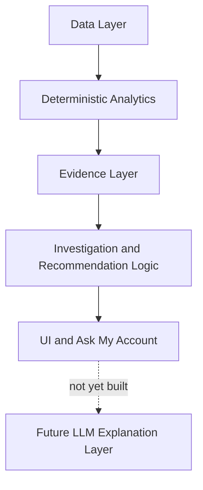
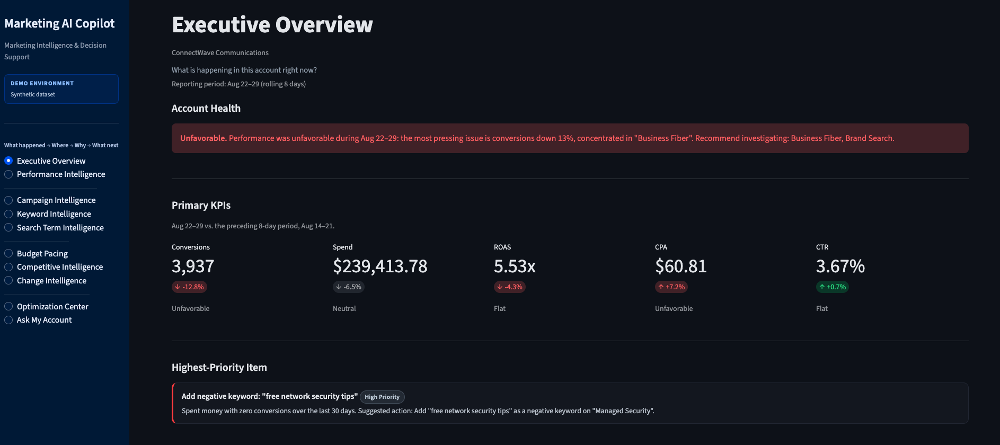
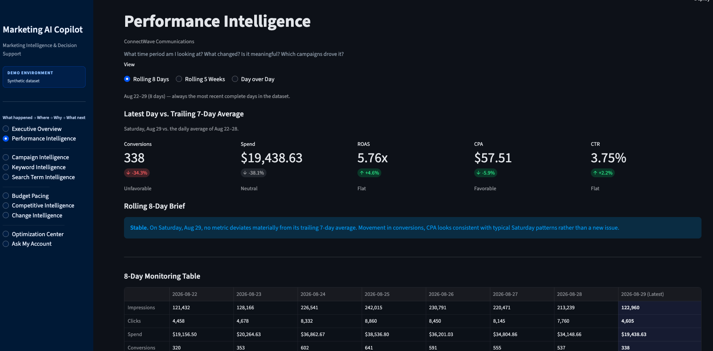
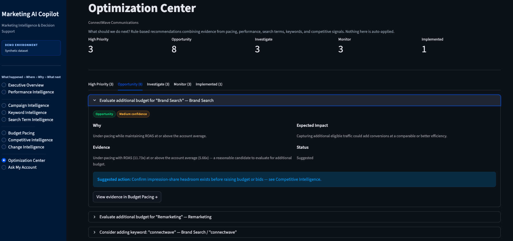
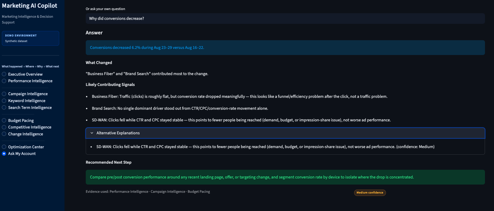
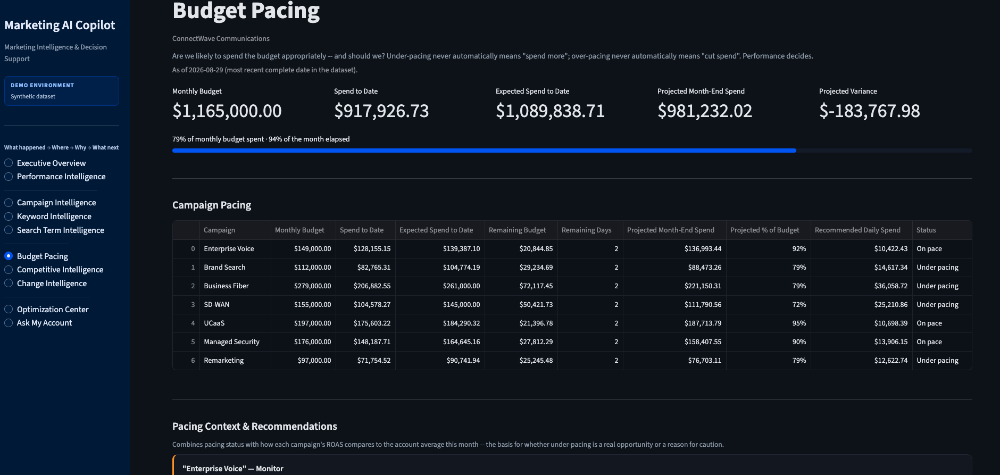

# Marketing AI Copilot

A decision-support application for paid media teams that turns campaign data into evidence-backed insights, investigations, and optimization recommendations.


Unlike an application that asks an LLM to calculate metrics or invent explanations, Marketing AI Copilot uses deterministic Python logic to calculate performance, detect material changes, identify contributing signals, and assemble supporting evidence. The architecture is designed so a future LLM layer can consume that structured evidence and produce richer conversational explanations — without ever replacing the underlying analytical engine.

**Demo environment · Synthetic dataset** — v1.0.0 runs entirely on synthetic data with no external LLM or API connections. See [Current Limitations](#current-limitations) for what that does and doesn't mean.

Marketing AI Copilot is architected as a **multi-channel paid-media intelligence platform**. v1.0.0 proves that architecture end to end using a synthetic paid-search dataset; additional advertising-platform integrations (Google Ads, Meta, LinkedIn, TikTok, and others) are roadmap items — see [Roadmap](#roadmap) — not current capabilities.

## Overview

Marketing AI Copilot is built for performance marketers and paid-media teams who need more than a reporting dashboard. v1.0.0's analytical implementation is paid-search focused — proving the architecture with campaign, keyword, and search-term-level intelligence — on a path toward broader paid-media coverage (see [Roadmap](#roadmap)). It:

- Monitors paid media performance on rolling 8-day and 5-week windows
- Detects which changes are actually meaningful, not just noisy day-to-day variance
- Diagnoses *where* in the account a shift originated — campaign, keyword, or search term
- Investigates *why* a shift may have happened, walking traffic, budget, competitive, and change-log evidence before concluding anything
- Recommends what to do next, with evidence and confidence attached to every recommendation
- Answers plain-English questions about the account through a deterministic, evidence-synthesizing router

## Why I Built It

Paid media teams usually have plenty of reporting and still spend their time re-answering the same four questions by hand:

- **What changed?**
- **Where did it change?**
- **Why might it have changed?**
- **What should I do next?**

Most tools stop at the first question. Marketing AI Copilot is built around all four — with the third one, "why," treated as a real investigation rather than a chart annotation. That meant building a deterministic reasoning engine before touching anything resembling AI: an engine that verifies a change is real, quantifies it, localizes it to specific campaigns, checks traffic/budget/competitive/change-log evidence, and only then proposes a hedged, confidence-rated hypothesis.

## Product Workflow

| Stage | Modules |
|---|---|
| **What happened?** | Executive Overview, Performance Intelligence |
| **Where did it happen?** | Campaign Intelligence, Keyword Intelligence, Search Term Intelligence |
| **Why might it have happened?** | Budget Pacing, Competitive Intelligence, Change Intelligence, Investigation Engine |
| **What should we do next?** | Optimization Center, Ask My Account |

## Key Capabilities

- **Rolling 8-day and rolling 5-week monitoring**, always derived from the latest date in the data — never a hardcoded "today"
- **Metric-aware favorability** — a CPA increase renders unfavorable, a CPA decrease favorable; direction alone never decides color
- **Campaign contribution analysis** for account-level changes, with mathematically valid math for additive metrics and separate deterioration/improvement ranking for ratio metrics
- **Point-and-click campaign investigation** — observed change, likely signal, alternative explanations, confidence, and a suggested next test
- **Multi-signal keyword and search-term classification** (never "waste" from CPA alone — spend *and* sub-1.0x ROAS are both required)
- **Context-aware budget pacing** — under-pacing only reads as an opportunity when efficiency supports it
- **Competitive/auction trend analysis** with percentage-point commentary distinguishing rank pressure from budget limitation
- **Change-history correlation** with before/after performance, always framed as timing, never causation
- **Evidence-backed recommendations**, categorized and cross-referencing the modules that produced them
- **Ask My Account** — deterministic natural-language question answering with structured evidence synthesis
- **Confidence levels and alternative explanations** throughout, never a fabricated statistic
- **9 documented synthetic scenarios** with known ground truth, used to validate the investigation engine
- **142 automated tests** covering calculations, formatting, classification, and reasoning logic

## Ask My Account

This is the most visible expression of the project's core idea: reasoning built on structured evidence, ready for a future language model to narrate.

**Question:** *"Why did conversions decrease?"*

The response is assembled from real, calculated evidence, organized into:

- **Answer** — the direct, quantified finding
- **What Changed** — which campaign(s) contributed most
- **Likely Contributing Signals** — the hypothesis per contributing campaign (traffic, conversion rate, budget, or competitive-driven)
- **Alternative Explanations** — other signals considered but not primary
- **Recommended Next Step** — a concrete follow-up test, not a vague suggestion
- **Evidence Used** — which modules (Performance, Campaign, Budget Pacing, Competitive, Change Intelligence) actually contributed
- **Confidence** — High / Medium / Low, based on how well-corroborated the finding is

When a metric hasn't moved materially, the router says so directly — the percentage change, the 5% materiality threshold it fell under, and a recommended monitoring action — rather than manufacturing an investigation.

This structure is deliberate: it's the exact shape of payload a future LLM layer would receive to generate richer prose. The model would explain the evidence; it would never calculate it.

## Investigation Methodology

Every investigation follows the same explicit sequence:

**Verify → Quantify → Localize → Investigate → Hypothesize → Test**

1. **Verify** the metric actually changed beyond normal noise
2. **Quantify** the change in absolute and percentage terms
3. **Localize** which campaign(s) drove it
4. **Investigate** the surrounding evidence — traffic, budget pacing, search-term quality, competitive signals, recent account changes
5. **Hypothesize** a likely driver, using transparent rules rather than a black box
6. **Test** that hypothesis against corroborating evidence before finalizing confidence

(See [docs/ARCHITECTURE.md](docs/ARCHITECTURE.md) for the full sequence, which continues through Conclude and Recommend.)

This process is built around a distinction the whole project treats as a first principle:

| Term | Meaning here |
|---|---|
| **Observation** | A metric moved. Nothing more is implied. |
| **Correlation** | A change happened near the time a metric moved. |
| **Hypothesis** | A rule-based, confidence-rated explanation, corroborated by other evidence. |
| **Recommendation** | A suggested next step or test — never an automatic action. |
| **Causation** | Never claimed. The application states correlation and confidence; it does not claim proof. |

## Architecture



Python calculates every metric, comparison, and threshold. The evidence layer composes those calculations across modules. The investigation and recommendation logic reasons over that evidence with transparent, testable rules. The UI presents it. A future LLM layer would sit at the end of that chain, turning already-computed evidence into richer natural language — it does not replace, recompute, or override anything upstream of it.

Full architectural detail, including the exact responsibilities of each `src/` module, is in [docs/ARCHITECTURE.md](docs/ARCHITECTURE.md).

## Tech Stack

- **Python 3.9+**
- **Streamlit** — UI framework, native dark theming, native charting (Vega-Lite under the hood)
- **pandas** — data manipulation and aggregation
- **pytest** — automated testing (142 tests)
- **Git / GitHub** — version control

No database, no external APIs, and no paid services are required to run this project.

## Synthetic Data & Ground Truth

All data in this repository is synthetic. "ConnectWave Communications" is a fictional telecom company — there is no real advertiser or account behind any number here. This is deliberate:

- No employer or client data is used or exposed
- The project can be shared publicly without any confidentiality concern
- Performance "stories" can be injected with **known ground truth**, so the investigation engine's conclusions can be checked against a documented, correct answer
- Ambiguity is intentional — not every scenario is designed to have a clean, obvious answer, because real accounts don't either

Nine documented scenarios (`data/scenario_ground_truth.csv`) exercise the investigation engine, including:

- Conversion-rate deterioration following a landing-page change
- CPC pressure from rising competitive/auction activity
- A budget cut causing a volume decline distinguishable from an efficiency problem
- Search-term waste dragging down blended conversion rate
- A measurable improvement following an implemented optimization
- Naturally-emergent keyword-expansion opportunities (not injected — a property of the baseline data)
- An account-level conversion decline built specifically to exercise Ask My Account's full structured investigation

## Testing

```bash
pytest
```

**142 passing, 0 failing** (verified against the current codebase).

Coverage includes: core metric calculations and safe division, display formatting, rolling-period construction, materiality thresholds, campaign contribution math (additive and ratio metrics), keyword and search-term classification, budget pacing and pacing-context logic, competitive trend chronological ordering, missing-value handling, change-log correlation, question routing, and cross-module evidence composition — plus a UI smoke test exercising every page and interactive control.

## Screenshots

<p>
  <br>
  <b>Executive Overview</b> — account health, KPIs, and the Performance Brief at a glance.
</p>

<p>
  <br>
  <b>Performance Intelligence</b> — rolling-period comparison with day-of-week-aware commentary.
</p>

<p>
  <br>
  <b>Optimization Center</b> — categorized, evidence-backed recommendations.
</p>

<p>
  <br>
  <b>Ask My Account</b> — a structured investigation response.
</p>

<p>
  <br>
  <b>Budget Pacing</b> — context-aware pacing recommendations.
</p>

## Running Locally

Requires Python 3.9+.

```bash
git clone https://github.com/valtarvertech/marketing-ai-copilot.git
cd marketing-ai-copilot

python3 -m venv .venv
source .venv/bin/activate      # Windows: .venv\Scripts\activate

pip install -r requirements.txt

python3 scripts/generate_synthetic_data.py   # only needed once, or to regenerate
streamlit run app.py
```

Then open the local URL Streamlit prints (usually `http://localhost:8501`).

## Repository Structure

```
app.py                  Streamlit entry point (thin router)
.streamlit/config.toml  Native dark theme configuration
src/                     Application logic
  data_loader.py, formatting.py, metrics.py       Normalization, display, and core calculations
  comparisons.py, rolling.py, contribution.py     Period comparisons and campaign contribution math
  investigation.py, evidence.py                   The investigation engine and cross-module evidence composition
  pacing.py, recommendations.py                   Budget pacing and the recommendation engine
  keyword_intelligence.py, search_term_intelligence.py, competitive.py, change_intelligence.py
  question_router.py, ai_layer.py                 Ask My Account routing and the future-AI interface
  ui_components.py, ui_sections.py                Shared UI building blocks and page rendering
data/                    Synthetic CSVs (campaigns, keywords, search terms, changes, auction insights, ground truth)
scripts/                 Synthetic data generator
tests/                   pytest suite (142 tests)
docs/                    Architecture, roadmap, and screenshot documentation
```

## Current Limitations

This is a **portfolio-ready synthetic-data release**, not a production system:

- Synthetic data only — no live advertiser account is connected
- No authentication or multi-user support
- No live ad-platform APIs (Google Ads, Microsoft Advertising, GA4, etc.)
- No external LLM — all reasoning is deterministic Python
- No persistent production database (flat CSVs, regenerated from a fixed seed)
- Recommendations are decision support only — nothing is auto-applied to a campaign
- Single demo account ("ConnectWave Communications"), not multi-tenant

## Roadmap

Full detail in [docs/ROADMAP.md](docs/ROADMAP.md). At a high level, the product evolves in stages:

1. **Current foundation** *(proven)* — normalized data schema, deterministic analytics, and the evidence/investigation architecture, demonstrated end to end on synthetic paid-search data.
2. **Live measurement & search integrations** — Google Ads, Microsoft Advertising, GA4, CRM/offline conversion sources, each plugging into the existing normalized schema without changing downstream analytics.
3. **Multi-channel paid-media expansion** — Meta Ads, LinkedIn Ads, TikTok Ads, and other paid-media platforms where appropriate.
4. **Cross-channel intelligence** — once multiple platforms share the same normalized schema, extend today's within-platform campaign contribution analysis and investigation evidence chain to rank *channel*-level contribution, not just campaign-level.
5. **AI explanation layer** — LLM-generated explanations from the structured evidence this app already produces, and richer Ask My Account conversations. The AI layer extends the deterministic analytical engine; it does not replace it.

### Product
Authentication, persistent account configuration, automated data refresh, alerting, and multi-account support.

## What This Project Demonstrates

- Paid-search domain expertise, proven as working software on an architecture intentionally designed to extend across paid-media channels rather than stay paid-search-only
- Turning raw campaign analytics into structured, evidence-based decision support
- Modular Python engineering with a clear separation between data, analytics, evidence, reasoning, and presentation
- A deliberate architectural choice to build deterministic analytics *before* introducing generative AI, with a defined seam for AI to extend rather than replace that logic
- Evidence-based reasoning design: confidence levels, alternative explanations, and an explicit refusal to claim causation from correlation
- Testing discipline, including controlled synthetic scenarios with documented ground truth used to validate reasoning logic, not just code paths
- Product and UX thinking about how a marketer actually wants to consume this information — monitor, diagnose, investigate, act
